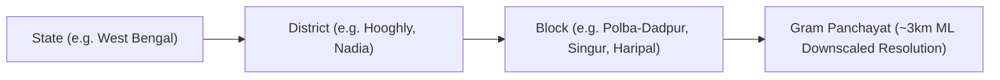

# Aurora Weather — Hyper-Local Agromet Intelligence Platform

[](https://react.dev/)
[](https://vite.dev/)
[](https://tailwindcss.com/)
[](LICENSE)

> An AI/ML-powered microclimate weather downscaling and precision agricultural advisory platform providing **Gram Panchayat-level resolution (~3km)** downscaled from coarse 9km WRF models.

---

## 📌 Overview

Traditional meteorological models provide coarse regional/block-level predictions (~9km grid resolution) that miss hyper-local microclimatic variations. **Aurora Weather** solves this by downscaling numerical weather prediction models into high-resolution, panchayat-level forecasts combined with crop-specific agronomic advisories, automated multi-hazard risk alerts, and multilingual farmer communications.

---

## ✨ Core Features

| Module | Description |
| :--- | :--- |
| 📍 **4-Tier Location Downscaling Inputs** | User input modal supporting **State ➔ District ➔ Block ➔ Gram Panchayat** with high-DPI glassmorphism, animated breadcrumb path, and downscaled telemetry generation. |
| 🌐 **Interactive Weather GIS Map** | 4-layer spatial telemetry (Rainfall, Temperature, Humidity, Wind speed) with interactive Gram Panchayat nodes, live radar animation, and vector contour visualizations. |
| ⚡ **ML Downscaled Forecast Engine** | Side-by-side comparison of coarse regional forecasts (9km WRF/Global) vs. high-resolution ML-downscaled panchayat predictions (~3km) with localized metrics. |
| 🌾 **Smart Crop Advisory** | Growth-stage specific agricultural recommendations (Rice, Potato, Jute, Mustard, Vegetables) with irrigation scheduling, fertilizer advice, and pest control measures. |
| ⚠️ **Automated Risk & Early Alert Engine** | Real-time threshold detection for flash floods, heatwaves, pest outbreaks, cold waves, and convective storms with SMS/audio broadcast capabilities. |
| 🗣️ **Multilingual Agromet Communication** | Agro-bulletins and advisories fully localized in **English**, **Bengali (বাংলা)**, and **Hindi (हिन्दी)** with text-to-speech (TTS) audio playback and agromet chatbot. |
| 📈 **Historical Climate Analytics** | High-DPI Recharts climate visualizations (rainfall comparisons, temperature profiles, relative humidity gradients, rainy day frequencies, and extreme event anomalies). |
| 📊 **Model Accuracy & Validation** | Real-time tracking of statistical accuracy metrics ($R^2$, MAE, RMSE) verifying downscaling model fidelity against IMD observation stations. |
| 📑 **Automated Report Generation** | Instant PDF export of daily weather summaries, weekly agro-bulletins, and alert logs. |

---

## 🏛️ Location Hierarchy Architecture

The platform operates on a strict 4-tier administrative hierarchy for weather downscaling:



### Supported Administrative Units:
- **Polba-Dadpur Block**: Amnan (`p1`), Babnan (`p2`), Sugandhya (`p3`), Polba (`p4`), Rajhat (`p5`), Makalpur (`p6`)
- **Chinsurah-Mogra Block**: Bandel (`p7`), Debanandapur (`p8`), Mogra (`p9`), Digsui-Hoera (`p10`)
- **Singur Block**: Balarambati (`p11`), Singur-I (`p12`), Singur-II (`p13`), Nasibpur (`p14`), Kamarkundu (`p15`)
- **Haripal Block**: Haripal (`p16`), Kaiba (`p17`), Ilipur (`p18`), Bhandarhati (`p19`), Dwarhatta (`p20`)

---

## 🛠️ Tech Stack

- **Frontend Core:** React 19, JavaScript (ESNext)
- **Build & Tooling:** Vite 8, Oxlint
- **Styling & Aesthetics:** Pure Glassmorphism Design System, Tailwind CSS v4, High-DPI font rendering (`-webkit-font-smoothing: antialiased`), Fluid responsive units (`calc(... * var(--u))`)
- **Animation & Transitions:** CSS Keyframe Animations (`modalPopUp`, `shimmerLine`, `pulseGlow`), Framer Motion
- **Data Visualization:** Recharts (ResponsiveContainer, BarChart, LineChart, AreaChart, ComposedChart)
- **Routing:** React Router v7

---

## 📁 Project Structure

```
sih-landing-page/
├── public/                      # Static assets & background media
├── src/
│   ├── assets/                  # Icons and media
│   ├── components/              # Reusable UI & layout components
│   │   ├── Header.jsx           # Global header with block context, search, & + button
│   │   ├── LocationSelectorModal.jsx # 4-Tier Location Input Modal (Pure Glassmorphism)
│   │   ├── Sidebar.jsx          # Glassmorphic sliding navigation rail
│   │   ├── Hero.jsx             # Telemetry hero showcase
│   │   ├── Forecast.jsx         # Hourly & 7-day forecast curves
│   │   ├── RightRail.jsx        # District block cards & quick switcher
│   │   ├── IconSprite.jsx       # Centralized SVG sprite library
│   │   └── ui/                  # Base UI components
│   ├── context/
│   │   └── DashboardContext.jsx # Global agromet state (Block/Panchayat, Crop, Stage, Telemetry)
│   ├── data/                    # Mock data & calculation engines
│   │   ├── mockWeather.js       # Panchayat & Block-level weather models
│   │   ├── mockPanchayats.js    # Spatial coordinates, 20 unique GP records & relations
│   │   ├── mockAdvisory.js      # Multilingual crop stage advisories (EN / BN / HI)
│   │   ├── mockRisks.js         # Hazard triggers & risk score matrices
│   │   └── mockHistorical.js    # Multi-decadal historical climate baseline
│   ├── lib/
│   │   └── styles.js            # Glassmorphism design tokens & tab base styles
│   ├── pages/                   # Application routes
│   │   ├── Landing.jsx          # High-conversion product landing page
│   │   ├── Login.jsx / Register.jsx # Authentication views
│   │   ├── Dashboard.jsx        # Main application shell with dynamic wallpaper
│   │   ├── Overview.jsx         # Block-level cockpit & regional overview
│   │   ├── WeatherMap.jsx       # Interactive 2D/GIS multi-layer map
│   │   ├── ForecastDownscaled.jsx # WRF vs. ML downscaled comparison
│   │   ├── RiskAlerts.jsx       # Hazard warnings & SMS broadcaster
│   │   ├── CropAdvisory.jsx     # Stage advisory, AI assistant & audio bulletins
│   │   ├── HistoricalTrends.jsx # Climate chart analytics (Non-clipped high-DPI charts)
│   │   ├── Accuracy.jsx         # Model evaluation statistics
│   │   ├── Reports.jsx          # Export & report generation
│   │   └── Settings.jsx         # Units preference & profile configuration
│   ├── App.jsx                  # Application router configuration
│   ├── main.jsx                 # React entry point
│   └── index.css                # Global CSS tokens & animation definitions
├── package.json
└── vite.config.js
```

---

## 🚦 Getting Started

### Prerequisites
- **Node.js**: `v18.0.0` or higher
- **npm** / **yarn** / **pnpm**

### Installation

1. **Clone the repository:**
   ```bash
   git clone https://github.com/NIRBANMANNA/SIH_PROJECT.git
   cd SIH_PROJECT
   ```

2. **Install dependencies:**
   ```bash
   npm install
   ```

3. **Start the local development server:**
   ```bash
   npm run dev
   ```
   Open your browser at `http://localhost:5173`.

---

## ⚡ Available Scripts

| Command | Action |
| :--- | :--- |
| `npm run dev` | Starts Vite local development server with Hot Module Replacement (HMR). |
| `npm run build` | Builds optimized production bundle into `/dist`. |
| `npm run preview`| Locally previews the production build. |
| `npm run lint` | Runs fast code linting via `oxlint`. |

---

## 🗺️ Application Routes

| Path | Screen | Functionality |
| :--- | :--- | :--- |
| `/` | **Landing Page** | Showcase, feature breakdown, interactive previews, and CTA. |
| `/login`, `/register` | **Auth** | User authentication screens with glassmorphic cards. |
| `/dashboard/overview` | **Cockpit** | Real-time Block-level aggregated weather, hourly & 7-day curves, quick block switcher. |
| `/dashboard/map` | **Weather Map** | Multi-layer spatial heatmap (Rainfall, Temp, Humidity, Wind). |
| `/dashboard/forecast` | **Downscaling** | Coarse Block WRF vs. ML Panchayat-level precision comparison. |
| `/dashboard/alerts` | **Risk & Alerts** | Active hazard monitor, severity categorization, and broadcast dispatch. |
| `/dashboard/cropadvisory` | **Crop Advisory** | Stage-specific guidance, multilingual bulletins, audio player, AI agromet bot. |
| `/dashboard/historical` | **Trends** | Long-term trend analysis and weather variation charts. |
| `/dashboard/accuracy` | **Accuracy** | Statistical evaluation metrics ($R^2$, RMSE, MAE). |
| `/dashboard/reports` | **Reports** | PDF summary and agromet report exporter. |
| `/dashboard/settings` | **Settings** | Units preference (°C/°F, km/h/mph) and user profile configuration. |

---

## 📄 License

This project is licensed under the MIT License.
