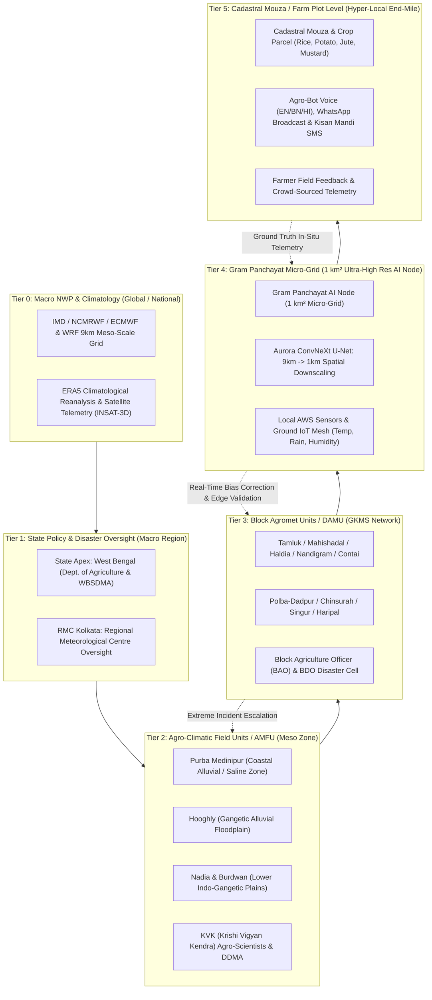

# Aurora Weather — Hyper-Local Agromet Intelligence Platform

[](https://react.dev/)
[](https://vite.dev/)
[](https://fastapi.tiangolo.com/)
[](https://python.org)
[](https://tailwindcss.com/)
[](https://leafletjs.com/)
[](https://docker.com)
[](LICENSE)

> **Smart India Hackathon (SIH)** — An AI/ML-powered microclimate weather downscaling and precision agricultural advisory network delivering **Gram Panchayat-level resolution (1 km²)** downscaled from regional 9 km WRF and numerical weather models.

---


## 📌 Overview

Traditional weather forecasts provide coarse regional predictions (~9 km to 25 km grid spacing) that fail to capture localized microclimatic variations—such as riverine humidity corridors, localized convective downpours, and elevation depressions. 

**Aurora Weather** bridges this gap through a unified full-stack architecture combining a **FastAPI ML downscaling inference backend** with a **high-performance React 19 frontend**. It delivers hyper-local telemetry across all Gram Panchayats in West Bengal, stage-specific crop advisories, multi-hazard risk alerts, animated GIS wind vector streamlines, and official printable PDF bulletins.

---

## ✨ Core System Capabilities

| Module | Features & Implementation |
| :--- | :--- |
| ⚡ **AI/ML Downscaling Engine** | FastAPI backend (`:8001`) interfacing with Aurora ML models to downscale 9km WRF grid forecasts to **1 km² Gram Panchayat precision** with latency tracking and statistical verification ($R^2$, RMSE, MAE). |
| 🎛️ **Live Model Console (`/dashboard/console`)** | Interactive model execution cockpit: select state, district, block, panchayat, and date to run real-time inference, inspect tensor outputs, downscaled temperature/rainfall deltas, and compute efficiency. |
| 🌐 **Interactive GIS Map (`/dashboard/map`)** | Dual basemaps (Satellite vs. High-Contrast Dark OSM), multi-layer telemetry heatmaps (Rainfall, Temp, Humidity, Wind), **AWS Sensor Station Pins** with live pulsing beacons, and **Dynamic Wind Vectors** with 60fps animated streamlines. |
| 📍 **Dynamic All-West Bengal Hierarchy** | Automatic district-to-block-to-panchayat resolution across all West Bengal districts (Purba Medinipur, Hooghly, Burdwan, Nadia, Howrah, Bankura, 24 Parganas, etc.) with dynamic coordinate generation. |
| ⚠️ **Risk Dashboard & Alert Center (`/dashboard/alerts`)** | Dynamic 6-dimension hazard evaluation (Heavy Rainfall, Waterlogging/Flood, Heat Stress, Drought, Strong Wind, Cold Stress), automated vulnerability scoring, dominant threat calculation, and multilingual SMS/IVR broadcast modal. |
| 📑 **Official PDF Report Generator (`/dashboard/reports`)** | Native client-side PDF compilation via `jsPDF` producing printable A4 Government of West Bengal Krishi-Meteorological Bulletins (Daily Weather Summary, Weekly Agro-Advisory, Risk & Alert Audit) with real-time in-page previews. |
| 🌾 **Crop Advisory & Agro-Bot (`/dashboard/cropadvisory`)** | Stage-specific agronomic guidance for Kharif/Rabi crops (Rice, Potato, Jute, Mustard, Vegetables) with audio playback, multilingual text (EN/BN/HI), and interactive AI agromet assistant. |
| 📈 **Historical Climate Analytics (`/dashboard/historical`)** | High-DPI Recharts analytics for precipitation anomalies, temperature ranges, humidity gradients, and multi-decadal extreme weather frequency curves. |

---

## 🏛️ Upgraded Administrative Hierarchy & Spatial Architecture

The platform features an advanced **6-Tier Bidirectional Multi-Scale Spatial Hierarchy** spanning from global/national Numerical Weather Prediction (NWP) models down to individual farm plots and farmer advisory channels:



### 📊 Multi-Tier Resolution & Operational Matrix

| Tier | Governance Level | Spatial Resolution | Core Stakeholders | Primary Functions |
|:---:|:---|:---:|:---|:---|
| **Tier 0** | **National / Global NWP** | $9 \times 9\text{ km}$ to $25\text{ km}$ | IMD, NCMRWF, MoES | Macro NWP ingest, synoptic charts, satellite radiances |
| **Tier 1** | **State Level** | $\sim 88,752\text{ km}^2$ | State Dept of Agriculture, WBSDMA | Macro relief planning, seasonal crop budgeting, policy directives |
| **Tier 2** | **District (AMFU)** | $\sim 2,500\text{ km}^2$ | District Magistrate, KVK Scientists, DDMA | Agro-climatic classification (Saline, Alluvial, Laterite), KVK validation |
| **Tier 3** | **Block (DAMU / GKMS)** | $\sim 200\text{ km}^2$ | Block Agriculture Officer (BAO), BDO | 3-day GKMS block bulletins, seed/fertilizer stock positioning |
| **Tier 4** | **Gram Panchayat (Microgrid)** | **$1 \times 1\text{ km}^2$ Ultra-Grid** | Panchayat Pradhan, Krishi Sahayak, IoT mesh | **Aurora ML downscaling**, flash-flood detection, microclimate alerts |
| **Tier 5** | **Mouza / Plot / Farmer** | **Cadastral Plot ($\le 250\text{m}$)** | Farmers, FPOs, Self-Help Groups | Multilingual voice agro-advisories (BN/HI/EN), crop disease spray timing |

### 🌾 Agro-Climatic Zone Mapping:
- **Coastal Saline Zone (Purba Medinipur, South 24 Parganas)**: Tamluk, Mahishadal, Haldia, Nandigram-I, Contai-I, Canning-I — Focus: *Cyclone wind gusts, salinity surges, drainage congestion*.
- **Gangetic Alluvial Floodplain (Hooghly, Howrah, Burdwan)**: Polba-Dadpur, Chinsurah-Mogra, Singur, Haripal, Burdwan-I — Focus: *High-intensity cloudbursts, Potato late blight forecasting, Kharif paddy inundation*.
- **Lower Indo-Gangetic Plains (Nadia, Murshidabad, North 24 Parganas)**: Krishnanagar-I, Ranaghat-I, Santipur, Barasat-I — Focus: *Heatwave stress, humidity anomalies, Jute retting advisories*.
- **Red & Laterite Belt (Bankura, Malda)**: Bankura-I, Bishnupur — Focus: *Soil moisture deficits, agricultural drought monitoring*.

-----

## 🛠️ Tech Stack

### Frontend:
- **Framework:** React 19.2, JavaScript (ESNext)
- **Build Tool:** Vite 8.2 (with Rollup & Oxlint)
- **Styling:** Tailwind CSS v4, Pure Glassmorphism Design System, CSS Keyframe Animations
- **Mapping & GIS:** Leaflet 1.9, React Leaflet 5.0
- **Document Export:** jsPDF 4.2
- **Data Visualization:** Recharts 3.10
- **Icons:** Lucide React, Centralized SVG Sprite Engine (`IconSprite.jsx`)
- **Routing:** React Router v7

### Backend:
- **Framework:** FastAPI, Uvicorn
- **ML & Numerical Libraries:** Python 3.10+, NumPy, PyTorch (inference bridge)
- **API Protocol:** RESTful JSON with CORS middleware

### Containerization & Deployment:
- **Container Engine:** Docker & Docker Compose
- **Web Server:** Nginx (Alpine production build)

---

## 📁 Repository Structure

```
SIH_PROJECT/
├── backend/                     # FastAPI Python ML Microservice
│   ├── main.py                  # API routes, CORS, downscaling inference endpoints
│   ├── inference_bridge.py      # Aurora ML model inference loader & downscaler
│   └── requirements.txt         # Python dependencies
├── ml_pipeline/                 # 🧠 Core AI/ML Downscaling & Training Pipeline
│   ├── models/                  # U-Net 3x resolution architecture (unet_3x.py)
│   ├── training/                # Training loop, dataset loaders, geo utilities
│   ├── inference/               # WRF loaders, predictors, API bridges
│   └── export_all.py            # Model serialization & export
├── public/                      # Static assets, logos, and media
├── src/
│   ├── assets/                  # Icons and images
│   ├── components/              # UI components
│   │   ├── Header.jsx           # Global header with active location & quick actions
│   │   ├── LocationSelectorModal.jsx # 4-Tier State-District-Block-GP location picker
│   │   ├── Sidebar.jsx          # Collapsible navigation rail
│   │   ├── RightRail.jsx        # Sister blocks & regional weather quick switcher
│   │   ├── Hero.jsx             # Active microclimate telemetry showcase
│   │   ├── Forecast.jsx         # Hourly timeline & 7-day weather curves
│   │   ├── IconSprite.jsx       # SVG sprite symbol library
│   │   └── ui/                  # Base UI building blocks
│   ├── context/
│   │   └── DashboardContext.jsx # Central state management (Location, Crop, Live API, Weather)
│   ├── data/                    # Data sources and dynamic computation models
│   │   ├── mockWeather.js       # Dynamic block & panchayat weather generator
│   │   ├── mockPanchayats.js    # Spatial coordinates, centroids, and GP telemetry
│   │   ├── mockRisks.js         # 6-dimension risk generator & disaster matrices
│   │   ├── mockAdvisory.js      # Multilingual crop growth stage advisories (EN/BN/HI)
│   │   └── mockHistorical.js    # Climate baseline historical records
│   ├── lib/
│   │   ├── api.js               # Frontend API client for FastAPI backend
│   │   └── styles.js            # Glassmorphism tokens & layout styles
│   ├── pages/                   # Application views
│   │   ├── Landing.jsx          # Public product landing page
│   │   ├── Login.jsx / Register.jsx # Authentication views
│   │   ├── Dashboard.jsx        # Shell with dynamic wallpaper & persistent layout
│   │   ├── Overview.jsx         # Block cockpit and telemetry overview
│   │   ├── WeatherMap.jsx       # Leaflet GIS map with AWS nodes & wind streamlines
│   │   ├── ForecastDownscaled.jsx # 9km WRF vs 1km ML comparison view
│   │   ├── ModelConsole.jsx     # Real-time ML downscaling execution console
│   │   ├── RiskAlerts.jsx       # Hazard monitor, action items & SMS/IVR broadcaster
│   │   ├── CropAdvisory.jsx     # Growth stage guidance, audio player, AI agromet bot
│   │   ├── HistoricalTrends.jsx # Climate visualizations and anomaly charts
│   │   ├── Accuracy.jsx         # Statistical validation metrics (R², RMSE, MAE)
│   │   ├── Reports.jsx          # jsPDF official bulletin compiler & previewer
│   │   └── Settings.jsx         # User preferences and profile configuration
│   ├── App.jsx                  # Application router configuration
│   ├── main.jsx                 # Client entry point
│   └── index.css                # Global CSS variables, animations & utilities
├── docker-compose.yml           # Multi-container orchestration
├── Dockerfile.frontend          # Optimized multi-stage Nginx container build
├── index.html                   # HTML document root
├── package.json                 # Node.js dependencies & scripts
├── vite.config.js               # Vite configuration with Tailwind CSS v4
└── README.md                    # Project documentation
```

---

## 🚦 Getting Started

### Prerequisites
- **Node.js**: `v18.0.0` or higher
- **Python**: `v3.10` or higher (for the ML backend)
- **Git**

---

### Local Development Setup

#### 1. Clone the repository:
```bash
git clone git@github.com:NIRBANMANNA/SIH_PROJECT.git
cd SIH_PROJECT
```

#### 2. Start the Python ML Backend:
```bash
# Optional: Create and activate virtual environment
python -m venv venv
# On Windows:
.\venv\Scripts\activate
# On Linux/macOS:
source venv/bin/activate

# Install backend dependencies
pip install -r backend/requirements.txt

# Start FastAPI Uvicorn server
python -m uvicorn backend.main:app --host 0.0.0.0 --port 8001 --reload
```
The backend will be live at `http://localhost:8001` (API docs at `http://localhost:8001/docs`).

#### 3. Start the Frontend Application:
In a separate terminal window:
```bash
# Install NPM dependencies
npm install

# Launch Vite development server
npm run dev
```
Open your browser at `http://localhost:5173`.

---

### Docker Deployment

To build and run the entire stack with Docker Compose:

```bash
docker-compose up --build
```
- Frontend: `http://localhost:5173`
- Backend: `http://localhost:8001`

---

## ⚡ Available Scripts

| Command | Action |
| :--- | :--- |
| `npm run dev` | Starts Vite dev server with Hot Module Replacement (HMR). |
| `npm run build` | Compiles production-ready bundle into `/dist`. |
| `npm run preview` | Previews production build locally. |
| `npm run lint` | Runs ultra-fast linting using `oxlint`. |

---

## 🔌 API Endpoints Reference

The FastAPI backend exposes the following endpoints:

| Method | Endpoint | Description |
| :--- | :--- | :--- |
| `GET` | `/api/health` | Healthcheck and service availability status. |
| `GET` | `/api/model-status` | Returns loaded weights, GPU/CPU acceleration, and grid size. |
| `POST` | `/api/downscale-forecast` | Runs AI microclimate downscaling for a block, panchayat, and date. |

#### Sample Prediction Request Payload:
```json
{
  "block": "Tamluk",
  "panchayat": "dyn_tamluk_p1",
  "date": "2026-09-05"
}
```

---

## 🗺️ Application Routes

| Path | Screen | Functionality |
| :--- | :--- | :--- |
| `/` | **Landing Page** | Platform overview, system architecture, feature cards, and CTA. |
| `/login`, `/register` | **Auth** | Glassmorphic user login and registration forms. |
| `/dashboard/overview` | **Overview Cockpit** | Live block-level weather, 7-hour and 7-day curves, and sister blocks. |
| `/dashboard/map` | **GIS Weather Map** | Satellite/OSM map, AWS sensor station pins, and animated wind streamlines. |
| `/dashboard/forecast` | **Downscaling View** | Coarse 9km WRF vs. 1km² ML-downscaled panchayat comparison. |
| `/dashboard/console` | **Model Console** | Live AI downscaling execution, latency telemetry, and tensor outputs. |
| `/dashboard/alerts` | **Risk & Alerts** | Multi-hazard assessment, dominant threat, and SMS/IVR broadcaster. |
| `/dashboard/cropadvisory` | **Crop Advisory** | Stage-specific farming advisory, audio playback, and agromet chatbot. |
| `/dashboard/historical` | **Climate Trends** | Multi-decadal climate analysis and extreme weather frequencies. |
| `/dashboard/accuracy` | **Model Accuracy** | Verification statistics ($R^2$, RMSE, MAE) against ground truth. |
| `/dashboard/reports` | **Generate Reports** | Live document previewer and official A4 PDF exporter via `jsPDF`. |
| `/dashboard/settings` | **Settings** | Units preference (°C/°F, mm/in, km/h/mph) and user preferences. |

---

## 📄 License

This project is open-sourced under the [MIT License](LICENSE).
